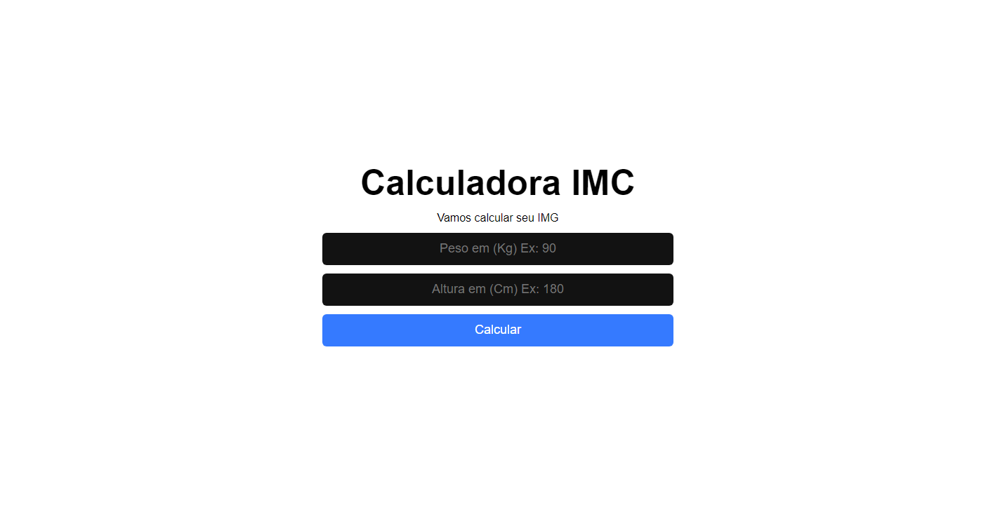
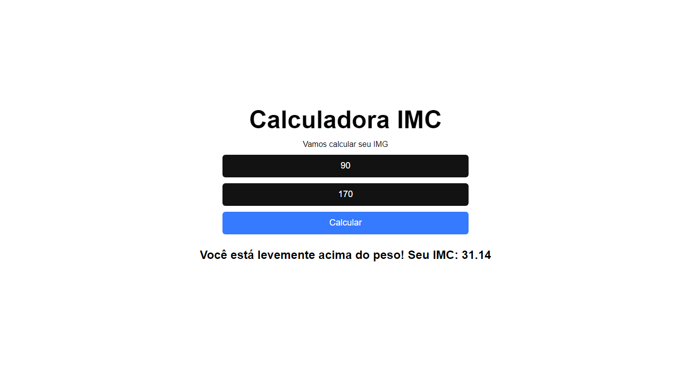
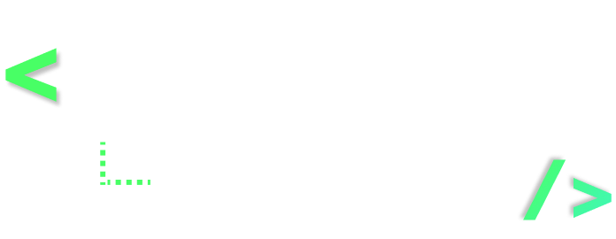

<h1 align="center">
    Calculadora de IMC
</h1>

<p align="center">
  <a href="#-projeto">Projeto</a>&nbsp;&nbsp;&nbsp;|&nbsp;&nbsp;&nbsp;
  <a href="#-tecnologias">Tecnologias</a>&nbsp;&nbsp;&nbsp;|&nbsp;&nbsp;&nbsp;
  <a href="#-executar aplicação">Executar Aplicação</a>&nbsp;&nbsp;&nbsp;|&nbsp;&nbsp;&nbsp;
  <a href="#-licença">Licença</a>
</p>

<p align="center">
 

  
</p>
<br>

## 💻 Projeto

Projeto consiste em uma **_ Calculadora de IMC _**.
<br>
A classificação do índice de massa corporal (IMC), pode ajudar a identificar obesidade ou desnutrição em crianças, adolescentes, adultos e idosos.
<br>
O projeto foi desenvolvido durante as aulas da Semana React JS da plataforma Sujeito Programador.
<br>

## Prévia vizualização do sistema

Demonstração do sistema

<p align="center">
    
</p>
 Resultado de uma consulta
<p align="center">
    
</p>

## Acessar o site

Para acessar o projeto Calculadora IMC na web [Clique aqui](https://calculadora-imc-wat.netlify.app/)
<br>

## 🚀 Tecnologias

Esse projeto foi desenvolvido com as seguintes tecnologias: <br>

- [React.js](https://pt-br.reactjs.org/)
- [CSS3](https://developer.mozilla.org/pt-BR/docs/Web/CSS)
- [Javascript](https://developer.mozilla.org/pt-BR/docs/Web/JavaScript/Guide/Introduction)

<br>

## Executar Aplicação

### 🔥 Executando Localmente a Aplicação

Caso você deseja executar o projeto na sua máquina local, você precisará instalar o Node.js em sua máquina. Após a instalação, basta seguir os passos abaixo:

### 🌀 Começando...

Para começar, você deve simplesmente clonar o repositório do projeto na sua máquina e instalar as dependências.

#### ❗️ Instalando as Dependências (via Windows):

Abre o cmd (caso esteja utilizando o Windows) navegue até o local onde você clonou o projeto, exemplo:

```sh
cd "C:\Users\NomeDoComputador\Documents\clonedoprojeto"
```

Depois, quando estiver na pasta do projeto, basta acessar o projeto frontend na pasta `calculadora-imc` digitar no cmd a seguinte instrução: **(dentro da pasta `calculadora-imc` do projeto clonado)**

```sh
npm install
```

Ao digitar a instrução acima, automaticamente ele irá baixar todas as dependências listadas e definidas no arquivo package.json:

- `node_modules` - que contêm os packages do npm que precisará para o projeto.

#### 💨 Executando a Aplicação

Bom, agora **(dentro da pasta `calculadora-imc` do projeto clonado)** abra um terminal para o projeto ser executado e digite:

```sh
npm start
```

Pronto! dessa forma o a `calculadora-imc` estará rodando localmente em sua maquina, para acessar abra o navegador no endereço abaixo:
<br>

```sh
http://localhost:3000
```

<br>

## 🚩 Tenho Dúvidas... O que fazer?

Caso tenham dúvidas sobre o código do projeto, sintam-se a vontade em abrir uma **[ISSUE AQUI](https://github.com/Wanderson-A-Timoteo/calculadora-imc/issues)**. Assim que possível, estarei respondendo as todas as dúvidas que tiverem!
<br>

## Licença

Esse projeto está sob a licença MIT. Veja o arquivo [LICENSE](LICENSE.md) para mais detalhes.

## Autor:

Feito com ♥ by

- **Wanderson A. Timóteo** - [Contatos](https://wanderson.tk)

<br>

## Agradecimentos:

<h1 align="center">
    
</h1>

- Projeto desenvolvido durante a Semana React JS da plataforma [Sujeito Programador](https://sujeitoprogramador.com/).

- Agradecimento ao instrutor [Matheus Fraga](https://www.linkedin.com/in/matheus-fraga-6940679a/) por compartilhar seu conhecimento.
